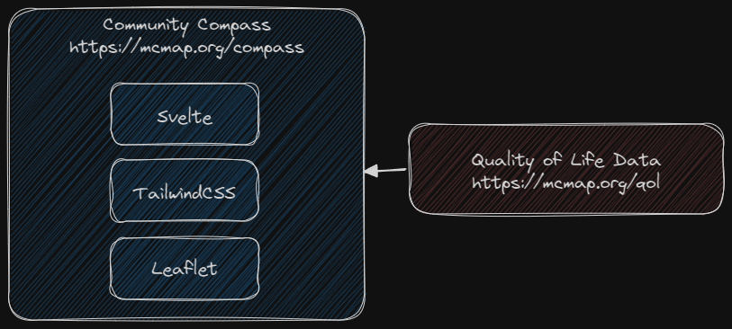

# Community Compass

Community Compass is a multi-variate report making tool based on the Quality of Life project, built with [Svelte](https://svelte.dev/), [TailwindCSS](https://tailwindcss.com/), and [Leaflet](https://leafletjs.com/). The development and build environment is [Vite](https://vitejs.dev/). It is designed to use data directly from the Quality of Life site.

Site: [https://mcmap.org/compass](https://mcmap.org/compass)

## Architecture



Community Compass is a single page application (SPA) and progressive web app (PWA). 


## Using the project

[Node.js](https://nodejs.org/en) is required to run the development and build systems, and [git](https://git-scm.com/) is required to use the versioning system.

### Clone the project
```bash
git clone https://github.com/tobinbradley/community_compass.git
```

### Install dependencies
```bash
cd community_compass
npm install
```

### Start the development server
```bash
npm run dev
```

Navigate a web browser to [http://localhost:3000](http://localhost:3000) to view the HMR live development server.

### Build for production
```bash
npm run build
```

After the build is complete, copy the contents of the `dist` folder to the production web server.
